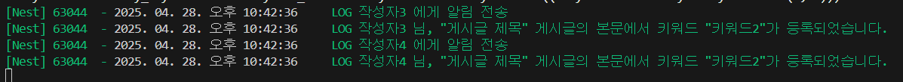
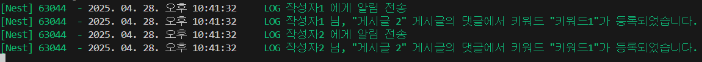

# NODE Project

익명 게시판 + 키워드 알림 기능

## 준비 사항

- node.js 22.11.o
- docker

## 기술 스택

- Node.js 22 (ES2024)
- NestJS 11
- TypeORM 11
- MySQL 8
- Docker, docker-compose
- DDD (Domain-Driven Design)

## 프로젝트 구성

- Post: 게시글 작성, 조회, 수정, 삭제
- Comment: 댓글 작성, 조회 (대댓글 지원)
- Keyword Alert: 게시글 및 댓글에 등록한 키워드가 있는 경우 등록자에게 알림 (단, 알림 과정은 구현하되 실제 알람 기능은 구현하지 않도록 함 )

## 설치 및 실행 방법

### 1. .env 파일 설정

| 1. .env 파일 생성

```bash
cp .env.dev .env
```

| 2. .env 파일 내용

DATABASE_HOST=localhost
DATABASE_PORT=3306
DATABASE_USER=board_user
DATABASE_PASSWORD=board_password
DATABASE_NAME=board
NODE_ENV=development

### 2. 패키지 설치

| npm 패키지 설치

```bash
npm install
```

### 3. MySQL 서버 세팅 (Docker)

| 1. 도커 로그인

```bash
docker login
```

| 2. 도커에 mysql 서버 세팅

```bash
docker-compose up -d
```

- MySQL 서버가 localhost:3306에 실행됩니다.
- 초기 설정
  - 데이터베이스명: board
  - 사용자명: board_user
  - 비밀번호: board_password

| 3. 테이블 스키마 생성 (typeorm migration)

스키마 생성을 위한 sql 파일 생성성

```bash
npm run migration:generate
```

sql 파일 실행하여 테이블 생성

```bash
npm run migration:run
```

| 4. 초기 데이터 세팅 (seeding)

```bash
npm run seed
```

- 게시글, 댓글, 키워드 알람 테이블의 초기 데이터 세팅

- 초기 데이터 특징
  - 게시글 비밀번호는 모두 1234로 통일
  - 댓글은 부모 댓글 5개, 대댓글 5개 생성
  - 키워드 알람
    - 작성자: "작성자1"~"작성자10" 존재
    - 키워드: "키워드1"~"키워드5" 존재
    - 하나의 키워드에 2명의 작성자가 등록 되어있음

## NestJS 서버 실행

| 프로젝트 시작

```bash
npm run start:dev
```

## 서버 HOST

- 서버는 http://localhost:7070 에서 접근할 수 있습니다.

## API 문서 & 테스트

| `nestjs/swagger` 사용 / swagger를 통해 API 테스트 가능
http://localhost:7070/api

## 주요 스크립트

- `npm run start:dev` 개발 서버 실행
- `npm run migration:generate` 새로운 마이그레이션 생성
- `npm run migration:run` 마이그레이션 적용
- `npm run migration:revert` 마지막 마이그레이션 롤백
- `npm run seed` 초기 데이터 세팅

---

- `npm run nest:ddd {domain name}` 지정한 domain 명으로 nestjs 에서 설계한 DDD 구조의 domain 자동 생성 스크립트

### 키워드 알림 예시

| 게시글

| 댓글

